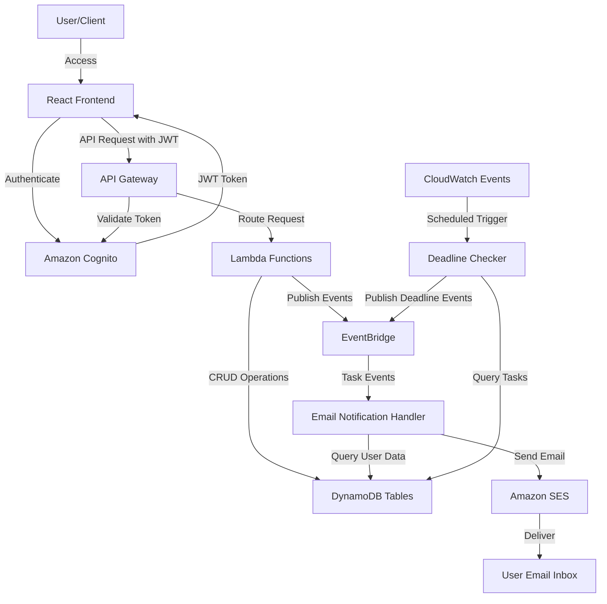
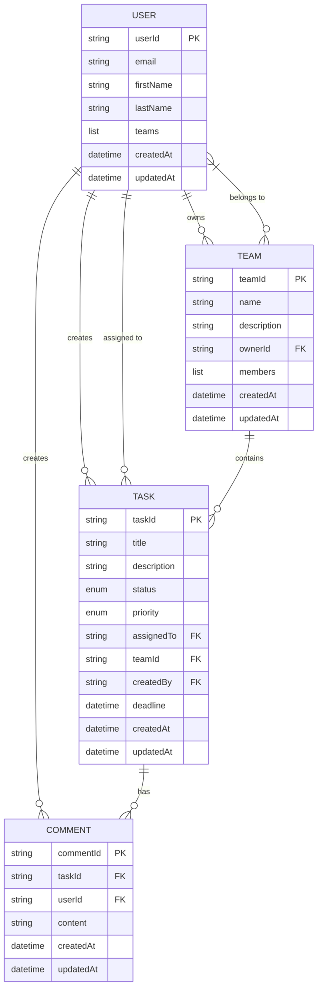

# TaskMonk Architecture Diagram

## System Architecture

```mermaid
graph TD
    subgraph "Frontend"
        ReactApp[React Application]
    end

    subgraph "API Layer"
        APIGateway[Amazon API Gateway]
    end

    subgraph "Authentication"
        Cognito[Amazon Cognito]
    end

    subgraph "Compute Layer"
        CreateUser[CreateUser Lambda]
        CreateTeam[CreateTeam Lambda]
        InviteToTeam[InviteToTeam Lambda]
        CreateTask[CreateTask Lambda]
        UpdateTaskStatus[UpdateTaskStatus Lambda]
        GetUserTasks[GetUserTasks Lambda]
        GetTeamTasks[GetTeamTasks Lambda]
        GetComments[GetComments Lambda]
        FilterTasks[FilterTasks Lambda]
        GenerateTaskReport[GenerateTaskReport Lambda]
        EmailNotificationHandler[EmailNotificationHandler Lambda]
        DeadlineChecker[DeadlineChecker Lambda]
    end

    subgraph "Data Layer"
        UsersTable[DynamoDB Users Table]
        TeamsTable[DynamoDB Teams Table]
        TasksTable[DynamoDB Tasks Table]
        CommentsTable[DynamoDB Comments Table]
    end

    subgraph "Event Processing"
        EventBridge[Amazon EventBridge]
    end

    subgraph "Notification Services"
        SES[Amazon SES]
    end

    subgraph "Content Delivery"
        S3[S3 Bucket]
        CloudFront[CloudFront Distribution]
    end

    %% Frontend connections
    ReactApp -->|HTTPS| CloudFront
    CloudFront -->|Origin| S3
    ReactApp -->|API Calls| APIGateway
    ReactApp -->|Authentication| Cognito

    %% API Gateway connections
    APIGateway -->|Authorize| Cognito
    APIGateway -->|Route| CreateUser
    APIGateway -->|Route| CreateTeam
    APIGateway -->|Route| InviteToTeam
    APIGateway -->|Route| CreateTask
    APIGateway -->|Route| UpdateTaskStatus
    APIGateway -->|Route| GetUserTasks
    APIGateway -->|Route| GetTeamTasks
    APIGateway -->|Route| GetComments
    APIGateway -->|Route| FilterTasks
    APIGateway -->|Route| GenerateTaskReport

    %% Lambda to DynamoDB connections
    CreateUser -->|Write| UsersTable
    CreateTeam -->|Write| TeamsTable
    CreateTeam -->|Read/Write| UsersTable
    InviteToTeam -->|Read/Write| TeamsTable
    InviteToTeam -->|Read| UsersTable
    CreateTask -->|Write| TasksTable
    CreateTask -->|Read| TeamsTable
    CreateTask -->|Read| UsersTable
    UpdateTaskStatus -->|Read/Write| TasksTable
    UpdateTaskStatus -->|Read| TeamsTable
    GetUserTasks -->|Read| TasksTable
    GetTeamTasks -->|Read| TasksTable
    GetTeamTasks -->|Read| TeamsTable
    GetComments -->|Read| CommentsTable
    GetComments -->|Read| TasksTable
    GetComments -->|Read| TeamsTable
    FilterTasks -->|Read| TasksTable
    FilterTasks -->|Read| TeamsTable
    FilterTasks -->|Read| UsersTable
    GenerateTaskReport -->|Read| TasksTable
    GenerateTaskReport -->|Read| TeamsTable
    GenerateTaskReport -->|Read| UsersTable

    %% Event-driven connections
    CreateTask -->|Publish Event| EventBridge
    UpdateTaskStatus -->|Publish Event| EventBridge
    EventBridge -->|Task Events| EmailNotificationHandler
    DeadlineChecker -->|Publish Event| EventBridge
    DeadlineChecker -->|Read| TasksTable
    EmailNotificationHandler -->|Read| UsersTable
    EmailNotificationHandler -->|Send Email| SES

    %% Schedule
    CloudWatch[CloudWatch Events] -->|Schedule| DeadlineChecker
```

## Data Flow Diagram

```mermaid
flowchart TD
    User[User/Client] -->|Access| Frontend[React Frontend]
    Frontend -->|Authenticate| Cognito[Amazon Cognito]
    Cognito -->|JWT Token| Frontend
    
    Frontend -->|API Request with JWT| APIGateway[API Gateway]
    APIGateway -->|Validate Token| Cognito
    
    APIGateway -->|Route Request| Lambda[Lambda Functions]
    Lambda -->|CRUD Operations| DynamoDB[DynamoDB Tables]
    
    Lambda -->|Publish Events| EventBridge[EventBridge]
    EventBridge -->|Task Events| NotificationLambda[Email Notification Handler]
    NotificationLambda -->|Query User Data| DynamoDB
    NotificationLambda -->|Send Email| SES[Amazon SES]
    SES -->|Deliver| UserEmail[User Email Inbox]
    
    CloudWatch[CloudWatch Events] -->|Scheduled Trigger| DeadlineLambda[Deadline Checker]
    DeadlineLambda -->|Query Tasks| DynamoDB
    DeadlineLambda -->|Publish Deadline Events| EventBridge
```

## Database Schema

```mermaid
erDiagram
    USER {
        string userId PK
        string email
        string firstName
        string lastName
        list teams
        datetime createdAt
        datetime updatedAt
    }
    
    TEAM {
        string teamId PK
        string name
        string description
        string ownerId FK
        list members
        datetime createdAt
        datetime updatedAt
    }
    
    TASK {
        string taskId PK
        string title
        string description
        enum status
        enum priority
        string assignedTo FK
        string teamId FK
        string createdBy FK
        datetime deadline
        datetime createdAt
        datetime updatedAt
    }
    
    COMMENT {
        string commentId PK
        string taskId FK
        string userId FK
        string content
        datetime createdAt
        datetime updatedAt
    }
    
    USER ||--o{ TEAM : "owns"
    USER }|--o{ TEAM : "belongs to"
    USER ||--o{ TASK : "creates"
    USER ||--o{ TASK : "assigned to"
    USER ||--o{ COMMENT : "creates"
    TEAM ||--o{ TASK : "contains"
    TASK ||--o{ COMMENT : "has"
```