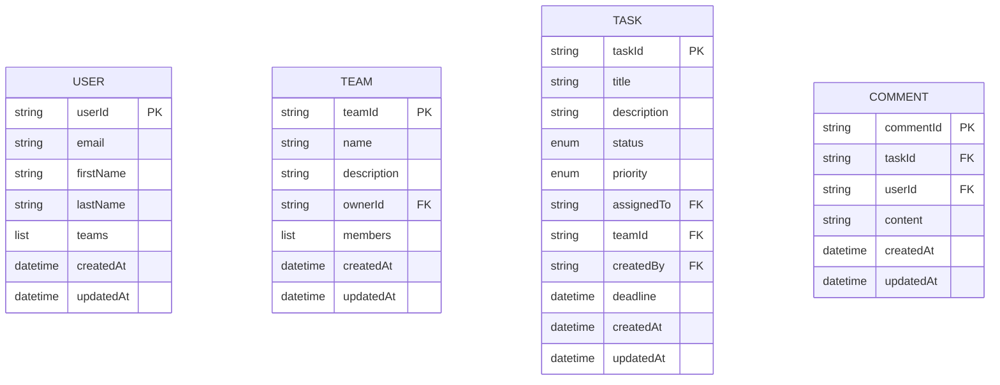

# Building TaskMonk: A Serverless Task Management System on AWS

In today's fast-paced work environment, effective task management is crucial for team productivity and project success. This article explores TaskMonk, a serverless task management system built on AWS that leverages modern cloud architecture to provide a scalable, reliable, and feature-rich solution for teams of all sizes.

## The Challenge of Modern Task Management

Organizations face numerous challenges when it comes to task management:

- **Team Collaboration**: Teams need to coordinate tasks across different members and departments
- **Real-time Updates**: Status changes and comments need to be instantly visible to all stakeholders
- **Scalability**: Systems must handle growing teams and increasing task volumes
- **Reliability**: Task data must be secure and always accessible
- **Cost-effectiveness**: Traditional server-based solutions can be expensive to maintain

TaskMonk addresses these challenges through a serverless architecture that provides high availability, automatic scaling, and a pay-for-what-you-use cost model.

## Architecture Overview: Embracing Serverless

TaskMonk is built entirely on AWS serverless technologies, eliminating the need for server management while providing enterprise-grade reliability and scalability.


The core components include:

### Backend Services

- **AWS Lambda (.NET 8)**: Handles all business logic through discrete functions
- **Amazon DynamoDB**: NoSQL database for storing tasks, teams, users, and comments
- **Amazon Cognito**: Manages user authentication and authorization
- **Amazon API Gateway**: Provides RESTful API endpoints
- **Amazon SES**: Sends email notifications for task assignments and updates
- **Amazon EventBridge**: Enables event-driven architecture for real-time updates

### Frontend Application

- **Next.js**: React framework for building the user interface
- **AWS Amplify**: Hosts and deploys the frontend application
- **Amazon CloudFront**: Delivers content with low latency globally

### Infrastructure as Code

- **AWS SAM/CloudFormation**: Defines and provisions all infrastructure

## Key Features of TaskMonk

TaskMonk provides a comprehensive set of features designed to streamline task management:

### 1. Task Management

Users can create, update, and track tasks with detailed information:
- Title and description
- Priority levels (Low, Medium, High, Critical)
- Status tracking (Todo, In Progress, Review, Done)
- Deadline management
- Team association

### 2. Team Collaboration

TaskMonk facilitates team collaboration through:
- Team creation and management
- Member invitations
- Task assignment within teams
- Comment threads on tasks

### 3. Real-time Notifications

The system keeps everyone informed through:
- Email notifications for task assignments
- Alerts for approaching deadlines
- Status change notifications
- Team invitation notifications

### 4. Reporting and Analytics

TaskMonk provides insights into team productivity:
- Task creation vs. completion rates
- Task distribution by status
- Team performance metrics
- Customizable date range filters

## Technical Deep Dive

Let's explore some of the technical aspects that make TaskMonk powerful and scalable.

### Event-Driven Architecture

TaskMonk uses Amazon EventBridge to implement an event-driven architecture. When a task is created or updated, events are published to EventBridge, triggering downstream processes like email notifications.

```csharp
private async System.Threading.Tasks.Task PublishTaskEvent(string eventType, Models.Task task)
{
    try
    {
        var eventDetail = JsonSerializer.Serialize(task);
        
        var putEventsRequest = new PutEventsRequest
        {
            Entries = new List<PutEventsRequestEntry>
            {
                new PutEventsRequestEntry
                {
                    Source = "taskmonk.tasks",
                    DetailType = eventType,
                    Detail = eventDetail,
                    EventBusName = "default"
                }
            }
        };
        
        await _eventBridgeClient.PutEventsAsync(putEventsRequest);
    }
    catch (Exception)
    {
        // Log but don't fail the main function if event publishing fails
    }
}
```

This approach decouples the core task management functionality from notification logic, making the system more maintainable and scalable.

### Serverless Data Access

TaskMonk uses DynamoDB for data storage, providing a serverless database that scales automatically with demand. The data model is designed to support efficient queries for common operations:



### Modern Frontend with Next.js

The frontend is built with Next.js, providing a responsive and interactive user experience. Components like the TaskForm handle task creation and updates:

```tsx
export default function TaskForm({ taskId }: TaskFormProps) {
  // State and hooks setup
  
  const handleSubmit = async (e: React.FormEvent) => {
    e.preventDefault();
    setError('');
    
    try {
      if (isEditing) {
        await updateTask.mutateAsync(formData);
      } else {
        await createTask.mutateAsync(formData);
      }
    } catch (err) {
      // Error handling
    }
  };
  
  // Form rendering
}
```

The frontend communicates with the backend through a RESTful API, with React Query handling data fetching, caching, and synchronization.

## Benefits of the Serverless Approach

TaskMonk's serverless architecture provides several key benefits:

### 1. Cost Efficiency

With serverless, you only pay for the actual compute time used. There are no costs for idle servers, making it ideal for applications with variable usage patterns.

### 2. Automatic Scaling

AWS Lambda and DynamoDB automatically scale to handle traffic spikes, ensuring consistent performance regardless of load.

### 3. High Availability

The distributed nature of serverless services provides built-in redundancy and fault tolerance across multiple availability zones.

### 4. Reduced Operational Overhead

No server management means developers can focus on building features rather than maintaining infrastructure.

### 5. Built-in Security

AWS services provide robust security features, including encryption at rest and in transit, IAM-based access control, and Cognito authentication.

## Deployment and CI/CD

TaskMonk uses AWS Amplify and GitHub Actions for continuous integration and deployment, automating the build and deployment process:

1. Code changes are pushed to the repository
2. GitHub Actions workflow is triggered for backend deployment
3. Backend code is built and deployed using AWS SAM
4. AWS Amplify automatically detects changes and deploys the frontend
5. CloudFront cache is invalidated to serve the latest content

This automation ensures rapid and reliable deployments with minimal manual intervention.

## Monitoring and Maintenance

TaskMonk leverages AWS CloudWatch for comprehensive monitoring:

- **Logs**: All Lambda functions write logs to CloudWatch
- **Metrics**: Key performance indicators are tracked
- **Alarms**: Alerts are configured for error conditions
- **Dashboards**: Custom dashboards provide system-wide visibility

For data protection, TaskMonk implements:
- Point-in-time recovery for DynamoDB tables
- Regular on-demand backups
- AWS Amplify branch deployments for frontend versioning

## Conclusion: The Future of Task Management

TaskMonk demonstrates how modern serverless architecture can create powerful, scalable applications without the traditional overhead of server management. By leveraging AWS services, it provides a robust task management solution that can grow with your organization.

The combination of serverless backend services, a responsive frontend, and event-driven architecture creates a system that is:

- **Scalable**: Handles growing teams and increasing workloads
- **Reliable**: Provides high availability and data durability
- **Cost-effective**: Optimizes resource usage and costs
- **Feature-rich**: Delivers comprehensive task management capabilities
- **Maintainable**: Simplifies updates and new feature development

As organizations continue to embrace remote and distributed work, tools like TaskMonk will become increasingly important for maintaining productivity and collaboration across teams.

---

*This article explores the architecture and implementation of TaskMonk, a serverless task management system built on AWS. The concepts and approaches discussed can be applied to a wide range of applications beyond task management, showcasing the power and flexibility of modern serverless architecture.*